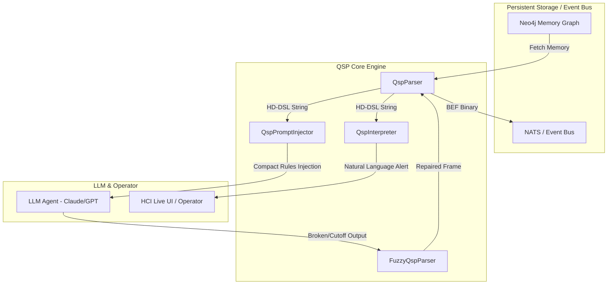

# QSP Core (Quantum Semantic Protocol)

[](LICENSE)
[](pyproject.toml)

---

## 🌐 Language Options / 언어 선택 / 语言选择
- [English (US)](#english-documentation)
- [한국어 설명 (Korean)](#한국어-설명-korean)
- [中文文档 (Chinese)](#中文文档-chinese)

---

## English Documentation

### 🚀 1. Background (Context & Mories Semantic Bridge)

In modern decentralized multi-agent ecosystems, collaborative intelligence is no longer restricted to a single LLM or machine. Heterogeneous autonomous agents (e.g., Claude, GPT-4, Llama) deployed across diverse machines must cooperate in real-time, aligning cognitive memories and executing complex task orchestrations. 

This vision of unified decentralized cognition is pioneered by the **[Mories Semantic Bridge Project](https://github.com/JungKiBong/mnemosyne)**. The **Mories Semantic Bridge** provides an authority-weighted shared long-term memory network and cognitive RAG architecture, enabling distributed agents to synchronize their knowledge graph dynamically over event buses like NATS JetStream. 

However, transferring heavy, unstructured natural language memories and verbose JSON payloads across distributed agents introduces major bottlenecks:
- **Token Inflation**: High costs and context-window congestion when injecting historical states into LLMs.
- **Network Congestion**: Massive bandwidth consumption over real-time message buses.
- **Semantic Ambiguity**: Casual natural language often causes smaller models to misinterpret commands or ignore state invariants.

**QSP (Quantum Semantic Protocol) Core** was developed to solve these fundamental bottlenecks. Acting as the semantic pipeline of the **Mories Semantic Bridge**, QSP replaces heavy JSON keys and raw natural language with a highly condensed symbolic syntax (HD-DSL) and compact binary packaging (BEF). It ensures **zero semantic ambiguity**, achieves **massive token and bandwidth savings**, and remains fully transparent to human operators through **multi-lingual NLG interpreters**.

---

### 🧠 2. Design & Principles

QSP operates across three specialized, lossless translation layers:



1. **High-Density DSL (HD-DSL)**: Condenses verbose JSON structures and redundant system state mappings into a single-line nested symbolic string.
2. **Binary Episodic Frame (BEF)**: A MessagePack-packed binary serialization designed for NATS networks and high-throughput databases, eliminating character-encoding bloat.
3. **Fuzzy Error Recovery (Fuzzy Parser)**: Employs a robust regular expression heuristics engine to repair unclosed brackets or cut-off JSON structures frequently output by smaller or quantized models.
4. **NLG Interpreter Gateway**: A multi-lingual Natural Language Generation (NLG) engine that stateless-ly translates symbolic states back into natural human alerts across six languages: **English, Korean, Japanese, Chinese, French, and Spanish**.

---

### 📊 3. Performance Benchmarks

Real-world benchmarks comparing QSP 2.0 with standard baseline JSON structures demonstrate dramatic efficiency improvements:

| Metric | Baseline JSON | QSP 2.0 (HD-DSL / BEF) | Net Saving Ratio |
| :--- | :---: | :---: | :---: |
| **LLM Context Size (Token Usage)** | 375 Bytes | **295 Bytes** | **21.33% Saved** |
| **Network Bandwidth (BEF Binary)** | 375 Bytes | **221 Bytes** | **41.07% Saved** |

---

### 💻 4. How to Use

#### Installation
```bash
pip install qsp-core
```

#### Code Example: End-to-End Workflow
```python
from qsp_core import QspParser, QspInterpreter

# 1. Encode structured parameters into HD-DSL
frame = QspParser.encode(
    actor="caeba",
    target_object="kernel_oom",
    mutation_from="stable",
    mutation_to="crash",
    resolves=["oom", "hang"],
    state="failure",
    severity="critical",
    emotions={"urgency": 0.95},
    meta="Out of memory in worker processes."
)

dsl_str = frame.to_hd_dsl()
print(f"Compressed HD-DSL:\n{dsl_str}\n")

# 2. Serialize to Binary Episodic Frame (BEF) for networks/storage
bef_bytes = frame.to_bef()
print(f"BEF Binary size: {len(bef_bytes)} bytes")

# 3. Parse/Restore back to QspFrame
parsed_frame = QspParser.parse_dsl(dsl_str)

# 4. Multi-lingual Human Alerts Translation
print(QspInterpreter.translate(parsed_frame, lang="en"))
# Output: 🔴 [URGENT] (2026-05-23 ...) Meta Agent CAEBA failed to patch KERNEL_OOM module from 'STABLE' to 'CRASH' due to unhandled exceptions in resolving Out of Memory (OOM) error and Server Hang/Deadlock state.

print(QspInterpreter.translate(parsed_frame, lang="zh"))
# Output: 🔴 [紧急] (2026-05-23 ...) 元代理 CAEBA尝试将 KERNEL_OOM 模块从 'STABLE' 修补为 'CRASH' 时失败...
```

---

## 한국어 설명 (Korean)

### 🚀 1. 배경 (개발 콘텍스트 및 모리스 시맨틱 브릿지)

현대의 인공지능 기반 분산형 멀티 에이전트 시스템에서, 에이전트 간의 고성능 협업은 단일 기기나 단일 모델의 제약을 넘어섭니다. 서로 다른 PC나 Mac 환경에 분산 배포된 이기종 자율 에이전트들(Claude, GPT-4, Llama 등)이 실시간으로 작업을 인지하고 위임하며 오케스트레이션하기 위해서는 서로의 기억과 상태를 오차 없이 공유할 수 있어야 합니다.

이러한 이기종 AI 에이전트의 거대 분산 인지망 인프라를 실현한 핵심 프레임워크가 바로 **[모리스 시맨틱 브릿지 프로젝트(Mories Semantic Bridge Project)](https://github.com/JungKiBong/mnemosyne)**입니다. **모리스 시맨틱 브릿지**는 권한 가중치 기반의 인메모리/네트워크 기억 공유 네트워크와 인지 RAG 구조를 통해, 여러 로컬 환경에 흩어진 에이전트들의 지식 그래프를 NATS JetStream 같은 이벤트 버스 상에서 완벽하게 동기화합니다.

그러나 이기종 에이전트 간에 원본 자연어 형태의 기억이나 무거운 JSON 페이로드를 실시간으로 전송하는 방식은 다음과 같은 치명적인 병목을 일으켰습니다:
- **토큰 소모량 급증**: 과거 대화 이력과 상태 정보(State Invariants)를 LLM 프롬프트에 지속적으로 주입할 때 입력 토큰을 심각하게 낭비하여 운용 비용이 늘어납니다.
- **네트워크 대역폭 낭비**: 실시간 데이터 스트리밍 환경에서 과도한 데이터 전송으로 패킷 레이턴시가 누적됩니다.
- **의미론적 할루시네이션**: 일반적인 자연어 메시지는 소형 온디바이스(Quantized) 모델들이 상태 전이 규칙을 오해하거나 명령을 누락하게 만듭니다.

**QSP (Quantum Semantic Protocol) Core**는 이러한 한계를 종식시키기 위해 설계되었습니다. **모리스 시맨틱 브릿지**의 심장부에서 고속 통신 파이프라인 역할을 수행하는 QSP는 무거운 JSON 구조와 수식어를 완전히 제거하고 단 한 줄의 상징 기호(HD-DSL) 및 바이너리 압축 프레임(BEF)으로 변환합니다. 이를 통해 **의미론적 왜곡을 0%**로 만들며, **LLM 토큰 및 네트워크 통신 용량을 비약적으로 절감**하고, 필요할 때는 **다국어 NLG 통역기**를 통해 사람이 즉각 가독할 수 있도록 역변환해 줍니다.

---

### 🧠 2. 주요 원리 및 구성 요소

QSP Core는 정보의 손실 없이 극한의 효율을 자랑하는 3단계 전송 및 변환 아키텍처를 제공합니다:

1. **고밀도 도메인 언어 (HD-DSL)**: 의미론적으로 꼭 필요한 상태 전이 정보, 감정 수치, 조치 내역(Resolves)만을 괄호 기호식 구조체로 완전 압축합니다.
2. **바이너리 에피소드 프레임 (BEF)**: 템플릿의 문자열 인코딩 패널티를 무력화하기 위해 내부 데이터를 고효율 MessagePack 바이너리 구조로 패킹하여 전송 크기를 약 41% 가량 단축시킵니다.
3. **Fuzzy 오류 실시간 치유 (Fuzzy Parser)**: 하청 에이전트(소형 LLM)가 QSP 기호를 완전히 닫지 못하거나 텍스트가 도중에 끊기더라도 정규식을 통해 에러를 물리적으로 자동 복구 및 파싱하는 강인한 런타임을 보장합니다.
4. **다국어 관제 NLG 통역기 (Interpreter)**: 기계용 기호로 압축된 QSP 프레임을 실시간으로 복원하여 사람이 읽을 수 있는 매끄러운 자연어 경보 문장으로 디코딩합니다. 현재 **한국어, 영어, 일본어, 중국어, 프랑스어, 스페인어** 등 총 6개 국어를 완벽 지원합니다.

---

### 📊 3. 실측 성능 지표 (Performance Benchmarks)

기존 JSON 페이로드 방식 대비 QSP 2.0을 적용했을 때의 실제 대폭 절감 수치입니다:

| 측정 기준 | 기존 JSON Baseline | QSP 2.0 (HD-DSL / BEF) | 최종 절감율 (Saving Ratio) |
| :--- | :---: | :---: | :---: |
| **LLM 컨텍스트 크기 (토큰 사용량)** | 375 Bytes | **295 Bytes** | **21.33% 토큰 절감** |
| **네트워크 대역폭 (BEF 바이너리)** | 375 Bytes | **221 Bytes** | **41.07% 대역폭 절감** |

---

### 💻 4. 적용 방법 및 사용처

#### 설치 방법
```bash
pip install qsp-core
```

#### 코드 예제
```python
from qsp_core import QspParser, QspInterpreter

# 1. 일반적인 락 해제 및 작업 전환 이벤트를 QSP HD-DSL로 인코딩
frame = QspParser.encode(
    actor="caeba",
    target_object="kernel_oom",
    mutation_from="stable",
    mutation_to="crash",
    resolves=["oom", "hang"],
    state="failure",
    severity="critical",
    emotions={"urgency": 0.95},
    meta="작업 프로세스 메모리 부족 감지."
)

dsl_str = frame.to_hd_dsl()
print(f"압축된 HD-DSL:\n{dsl_str}\n")

# 2. 네트워크 전송을 위한 바이너리(BEF) 패킹
bef_bytes = frame.to_bef()
print(f"BEF 바이너리 크기: {len(bef_bytes)} 바이트")

# 3. 디코딩 및 프레임 복원
parsed = QspParser.parse_dsl(dsl_str)

# 4. 다국어 NLG 통역 관제 테스트
print(QspInterpreter.translate(parsed, lang="ko"))
# 출력: 🔴 [긴급] (2026-05-23 ...) 메타 에이전트 카에바(CAEBA)가 KERNEL_OOM 모듈을 'STABLE'에서 'CRASH'로 패치하려 했으나, 메모리 부족 현상(OOM) 오류 및 서버 무반응 교착 상태 조치 과정에서 장애가 발생하여 실패했습니다.

print(QspInterpreter.translate(parsed, lang="zh"))
# 출력: 🔴 [紧急] (2026-05-23 ...) 元代理 CAEBA尝试将 KERNEL_OOM 模块从 'STABLE' 修补为 'CRASH' 时失败...
```

---

## 中文文档 (Chinese)

### 🚀 1. 背景 (开发上下文与 Mories 语义桥项目)

在现代去中心化的多智能体（Multi-Agent）协作生态系统中，AI 之间的协作效率早已突破了单台设备或单一模型的物理边界。部署在不同 PC 或 Mac 上的异构智能体（如 Claude, GPT-4, Llama）需要高并发、实时地进行认知同步和任务指派。

实现这种去中心化多智能体全景认知对齐的核心框架正是 **[Mories 语义桥项目 (Mories Semantic Bridge Project)](https://github.com/JungKiBong/mnemosyne)**。**Mories 语义桥**通过基于权限权重的长期记忆共享网络和认知 RAG 架构，使多台设备上的异构智能体能够通过 NATS JetStream 等事件总线，在毫秒级内完成分布式知识图谱的动态对齐。

然而，智能体之间若直接传输冗长无结构的人类自然语言，或体积庞大的 JSON 状态数据，会带来以下致命痛点：
- **Token 急剧膨胀**：将详细的历史状态注入 LLM 上下文时，会浪费极高的 Prompt Token，大幅推高调用成本。
- **大带宽资源占用**：实时并发同步场景下，字符串格式的消息传输会产生显著的网络延迟。
- **语义幻觉与指令丢失**：传统的自然语言容易导致小型离线端侧模型产生理解偏差，忽视核心的状态机转移规则。

为了解决这一行业共性瓶颈，**QSP (Quantum Semantic Protocol) Core** 应运而生。作为 **Mories 语义桥** 内部的高效通信管道，QSP 彻底剥离了冗长的 JSON 嵌套结构和自然语言修饰，将其完全符号化为单行极其精炼的符号指令（HD-DSL）和紧凑的二进制帧（BEF）。它达成了**零语义歧义**，**大幅降低了 LLM 调用开销和传输网络负载**，并拥有高可靠的**多语言 NLG 翻译器**，以确保人类的完全可控性。

---

### 🧠 2. 核心原理与设计

QSP Core 构建了极致高效、且完全无损的三个翻译与传输层面：

1. **高密度域专属语言 (HD-DSL)**: 仅提取最核心的状态转移、情绪系数和修复方案，将其压缩为由符号和括号包裹的高维语义串。
2. **二进制插曲帧 (BEF)**: 使用 MessagePack 二进制序列化对数据进行紧凑打包，避免字符集编码带来的体积损失，减少约 41% 的网络传输字节。
3. **模糊错误实时愈合 (Fuzzy Parser)**: 即使较小参数的智能体在生成 DSL 符号时，发生括号缺失、括号不闭合或文本异常中断，该层内嵌的强韧正则匹配引擎也能实现物理级的实时纠错和自动补全。
4. **多语言 NLG 翻译网关 (Interpreter)**: 将纯符号指令无损复原为可读性极佳的实时监控警报。目前已原生支持 **中文、英语、韩语、日语、法语、西班牙语** 6 国语言。

---

### 📊 3. 实测性能对比 (Performance Benchmarks)

在相同的测试用例下，QSP 2.0 对比传统 JSON Payload 实现了极为明显的性能优化：

| 评测维度 | 传统 JSON 基线 | QSP 2.0 (HD-DSL / BEF) | 实际节省率 |
| :--- | :---: | :---: | :---: |
| **LLM 上下文体积 (Token 消耗)** | 375 Bytes | **295 Bytes** | **降低 21.33% Token** |
| **网络传输带宽 (BEF 二进制字节)** | 375 Bytes | **221 Bytes** | **降低 41.07% 流量** |

---

### 💻 4. 快速入门与集成方法

#### 安装库
```bash
pip install qsp-core
```

#### 代码示例
```python
from qsp_core import QspParser, QspInterpreter

# 1. 将结构化状态编码为符号化的 HD-DSL 字符串
frame = QspParser.encode(
    actor="caeba",
    target_object="kernel_oom",
    mutation_from="stable",
    mutation_to="crash",
    resolves=["oom", "hang"],
    state="failure",
    severity="critical",
    emotions={"urgency": 0.95},
    meta="检测到工作进程内存不足。"
)

dsl_str = frame.to_hd_dsl()
print(f"压缩后的 HD-DSL 串:\n{dsl_str}\n")

# 2. 打包为适用于 NATS 传输的二进制 BEF 格式
bef_bytes = frame.to_bef()
print(f"BEF 二进制体积: {len(bef_bytes)} 字节")

# 3. 解析与状态还原
parsed = QspParser.parse_dsl(dsl_str)

# 4. 多语言 NLG 人类可读文本翻译
print(QspInterpreter.translate(parsed, lang="zh"))
# 输出: 🔴 [紧急] (2026-05-23 ...) 元代理 CAEBA尝试将 KERNEL_OOM 模块从 'STABLE' 修补为 'CRASH' 时失败，原因是在处理 内存不足 (OOM) 错误 及 服务器无响应死锁状态 时发生未处理的异常。

print(QspInterpreter.translate(parsed, lang="ko"))
# 输出: 🔴 [긴급] (2026-05-23 ...) 메타 에이전트 카에바(CAEBA)가 KERNEL_OOM...
```

---

## 📜 License
QSP Core is distributed under the terms of the **Apache License 2.0**. See the [LICENSE](LICENSE) file for details.

---
© 2026 **Kibong Jung** (JKBrown8408@gmail.com). All rights reserved.
